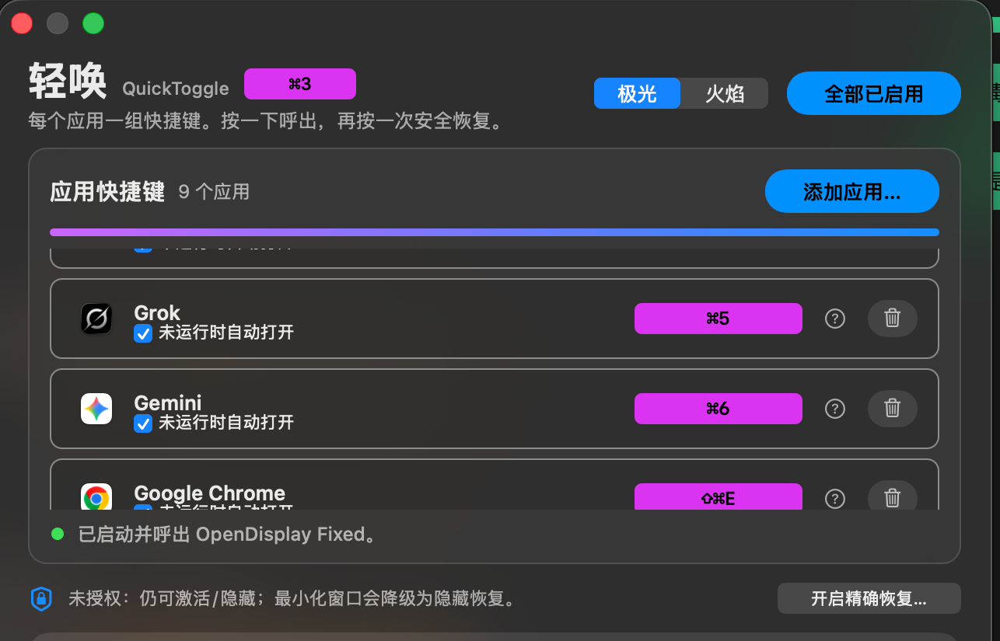
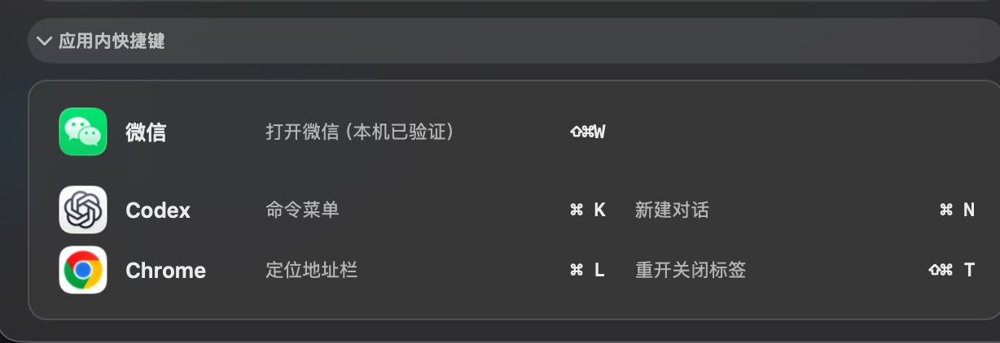

# 轻唤（QuickToggle）使用说明

版本：`0.0.5`  
仓库：https://github.com/BLACKIELF/QuickToggle  
下载：https://github.com/BLACKIELF/QuickToggle/releases/tag/v0.0.5

轻唤只做一件事：给常用 App 一组**全局快捷键**。按一下呼出，再按一次安全隐藏或回到刚才的前台。它是原生 macOS 菜单栏程序，不联网、没有账号、没有更新器。



## 1. 安装

1. 从 [v0.0.5 Release](https://github.com/BLACKIELF/QuickToggle/releases/tag/v0.0.5) 下载 `QuickToggle-0.0.5-macOS-arm64.zip`。
2. 解压得到 `QuickToggle.app`。当前是 ad-hoc 签名，没有 Apple 公证。
3. 第一次打开若被拦截：系统设置 → 隐私与安全性 → 仍要打开。
4. 菜单栏出现火焰图标即表示在跑。**轻唤没在跑时，所有全局快捷键都会一起失效。**

从源码构建：

```bash
cd work/QuickToggle
bash build.sh
open "build/QuickToggle.app"
```

Apple Silicon、macOS 13+。

## 2. 打开设置

- 默认快捷键：`⌘3`（可在标题旁直接改）。
- 或点菜单栏火焰 → 显示设置。

设置页从上到下：

1. 标题与设置窗口快捷键
2. 应用快捷键列表（主功能，按 `⌘数字` 优先升序排列，未设置的排最后）
3. 状态行（已探测：空闲 / 占用）
4. 辅助功能权限
5. 登录时启动（默认关）
6. macOS 原生快捷键（默认收起，点开在本页展开）
7. 应用内快捷键（默认收起，只读参考；区内含可编辑的「本机已占用」列表）



## 3. 添加应用并录制快捷键

1. 点「添加应用…」，从已安装可视应用里选，或从磁盘挑 `.app`。不会自动注册快捷键。
2. 若 `⌘1–9` 还有空闲组合，添加后轻唤会自动分配下一个（自动跳过「本机已占用」列表和设置窗口快捷键 `⌘3`）；不满意可当场在本行改。全部占满时需手动录制。
3. 点该行右侧录制按钮，按下组合键。
4. Esc 取消；Delete / Backspace 清除。
5. 保存后立即生效。

**每次录制都会自检：**

1. 应用还在不在
2. 是不是已经被轻唤里别的应用占用
3. 是不是在「本机已占用」列表里（默认带 Aident `⌘1`、Wi‑Fi 菜单 `⌘2`、微信 `⇧⌘W` 三条；可在设置 → 应用内快捷键区增删）
4. Carbon 能否独占注册

空闲才会改键。占用则保留原快捷键，状态栏写「已探测：占用」。

## 4. 两次按键怎么走

| 当时状态 | 第一次 | 第二次 |
|---|---|---|
| 目标已隐藏 | 呼出 | 再藏回去 |
| 目标已在前台 | 安全隐藏，不关窗口 | — |
| 窗口全最小化 | 有辅助功能时只恢复一个窗口 | 只把这个窗口再最小化 |
| 目标已显示但不在前台 | 激活 | 隐藏并尽量回到刚才的前台 |

刚呼出立刻再按一次，也会隐藏。若你已经手动切到别的 App、目标重启、或窗口已被藏起，这次会重新呼出，不会把按键吞掉。

## 5. 快捷键规则

- 优先：未占用的 `⌘0–9`
- 也可用：`⌘⌥K`、`⌘⇧K`、`⌃⇧K`、`⌘⌥←/→`、`⌃⇧F1–F12`
- 字母 / 方向键 / F 键：至少两个修饰键，且必须包含 Command 或 Control
- 系统保留组合会被拦住
- 每个应用必须用不同组合
- Carbon 只能发现独占冲突；应用内部非独占快捷键发现不了，所以「应用内快捷键」只展示已核实的少量项，绝不编造

## 6. 权限与登录

- **辅助功能**：默认不用。精确恢复某个最小化窗口时，点「开启精确恢复…」才申请。
- **登录时启动**：默认关。打开后由 macOS 登录项启动轻唤，不另加 LaunchAgent。开机后要快捷键继续可用，打开这个开关。

## 7. 配置导出与导入

- **导出**：菜单栏 → 导出配置…，生成 `quicktoggle-backup-日期.json`。内容含全部应用绑定、设置快捷键、启用状态和「本机已占用」列表。
- **导入**：菜单栏 → 导入配置…，选此前的备份文件，确认后整体替换当前配置。备份里本机没装的应用会自动跳过，并在状态里点名。
- **换机流程**：旧机导出 → 拷贝 JSON → 新机导入。纯本地文件，不联网。

## 8. 休眠与更新

- 唤醒、解锁、点菜单栏、打开设置时，会强制重新注册全部快捷键。
- 磁盘上的 App 比正在跑的进程新时，会自动重启换成新包。
- 菜单栏顶部有一行只读的「轻唤 版本 (build N)」，用来确认当前跑的是不是新包。

## 9. 隐私

不联网、不上传、无遥测、无账号。应用列表、快捷键、主题和配置备份只存在本机。MIT License。

## 10. 示例图

| 文件 | 用途 |
|---|---|
| `screenshots/settings-list-clean.png` | 设置页主列表 |
| `screenshots/in-app-shortcuts.png` | 应用内快捷键参考 |
| `screenshots/app-icon.png` | 应用图标 |
| `tweet/tweet-card.jpg` | 推文封面（16:9） |
| `tweet/icon-keycap.jpg` | 键帽特写（1:1） |
| `tweet/settings-list.jpg` | 推文用设置截图 |
